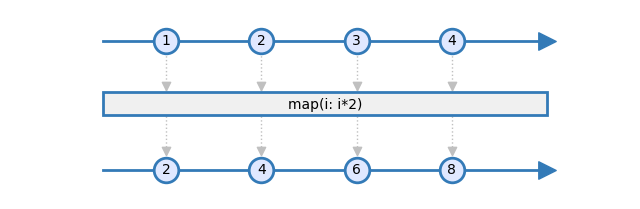
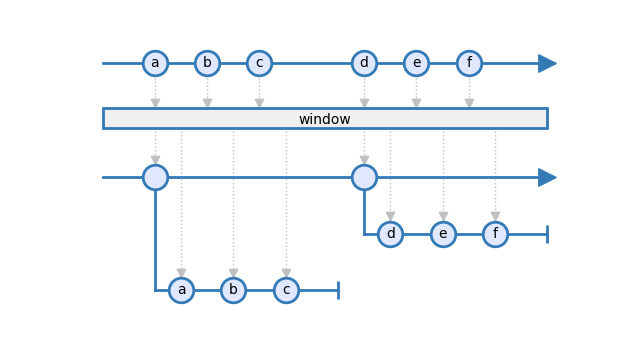
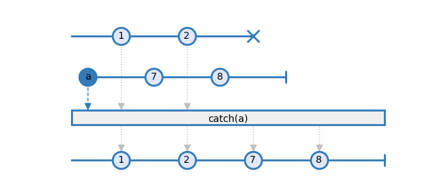

======
dooble
======

.. image:: https://img.shields.io/pypi/v/dooble.svg
        :target: https://pypi.python.org/pypi/dooble

.. image:: https://img.shields.io/travis/MainRo/dooble.svg
        :target: https://travis-ci.org/MainRo/dooble

Dooble is a marble diagram generator from text. It eases the documentation of
ReactiveX standard and custom operators, in a consitent way.

Installation
-------------

.. code:: python

        pip install dooble

A sphinx plugin is also available:

.. code:: python

        pip install sphinxcontrib-dooble

Usage
------

The text grammar allows to easilly define *observables* and *operators*. The map
operator with an input observable and an output observable is described the
following way:

.. code::

        --1--2--3--4-->
        [ map(i: i*2) ]
        --2--4--6--8-->

save this text in a file named *map.txt* and then render it to an image:

.. code:: console

        dooble --input map.txt --output map.png

The generated image looks like this:

*Higher order observables* can also be documented easilly:

.. code::

        --a-b-c---d-e-f-->
        [     window     ]
        --+-------+------>
                  +d-e-f-|
          +a-b-c-|

save this text in a file named *window.txt* and then render it to an image:

.. code:: console

        dooble --input window.txt --output window.png

The generated image looks like this:

For operators that take several observables as input, it is possible to label
them:

.. code::

        --1--2--3--*
                 a-7-8-|
        [   catch(a)   ]
        --1--2--3--7-8-|

save this text in a file named *catch.txt* and then render it to an image:

.. code:: console

        dooble --input catch.txt --output catch.png

The generated image looks like this:

